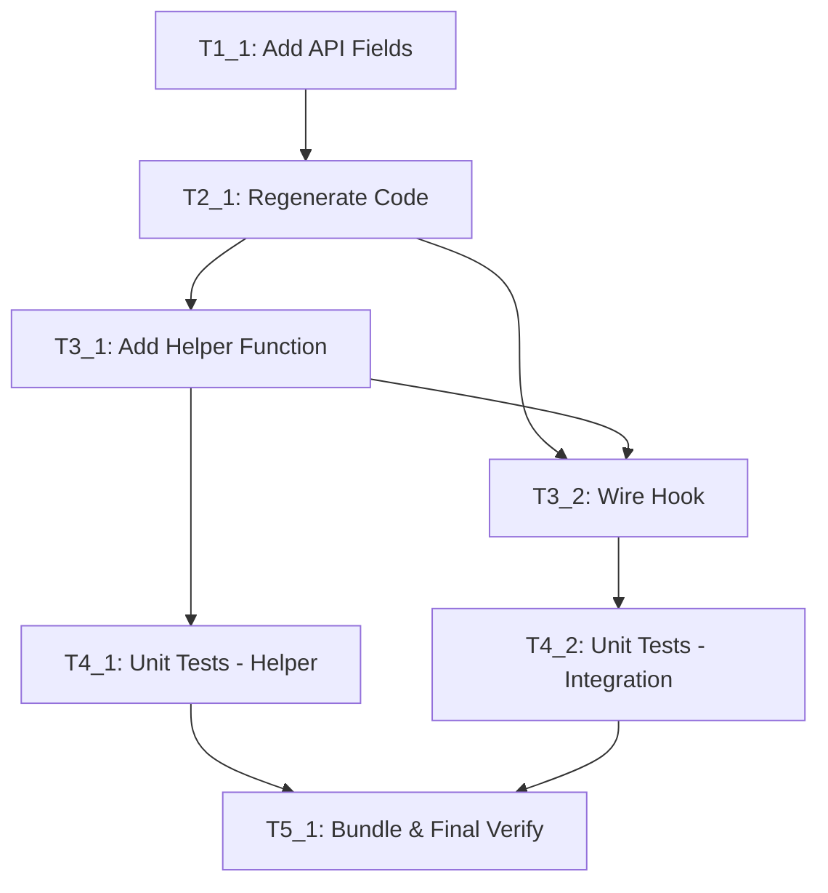

# Execution Backlog
**Feature:** Cert-Manager Performance Tuning Parameters (RFE-5620)
**AgentRoutingMode:** PROVISIONAL
**ConstitutionVersion:** 1.0

---

## §0 Input Coverage Checklist

### Functional Requirements → Tasks

| FR ID | Description | Task IDs |
|-------|-------------|----------|
| FR-001 | Configure concurrent-workers via operator API | T1_1, T3_1 |
| FR-002 | Configure max-concurrent-challenges via operator API | T1_1, T3_1 |
| FR-003 | Configure kube-api-qps via operator API | T1_1, T3_1 |
| FR-004 | Configure kube-api-burst via operator API | T1_1, T3_1 |
| FR-005 | Use upstream defaults when not specified | T3_1 |
| FR-006 | Propagate params to controller deployment as CLI args | T3_1, T3_2 |
| FR-007 | Update deployment when params modified | T3_1, T3_2 |
| FR-008 | Preserve params across operator upgrades | T3_1 (implicit) |

### Success Criteria → Tasks

| SC ID | Description | Task IDs |
|-------|-------------|----------|
| SC-001 | Params reflected in deployment within one reconcile | T4_1, T4_2 |
| SC-002 | Verifiable via deployment spec inspection | T4_2 |
| SC-003 | Existing e2e tests pass | T5_1 |
| SC-004 | Live parameter updates work | T4_1 |

### Plan Phases → Tasks

| Phase | Description | Task IDs |
|-------|-------------|----------|
| Phase 1 | API Definition | T1_1 |
| Phase 2 | Code Generation | T2_1 |
| Phase 3 | Controller Logic | T3_1, T3_2 |
| Phase 4 | Unit Tests | T4_1, T4_2 |
| Phase 5 | Bundle & Verification | T5_1 |

---

## §1 Task Dependency Graph



---

## §2 Linear Execution Order

1. **T1_1** — Add Performance Tuning API Fields
2. **T2_1** — Regenerate DeepCopy and CRD Manifests
3. **T3_1** — Implement getPerformanceArgsFor Helper
4. **T3_2** — Wire Performance Args Hook into Controller
5. **T4_1** — Add Unit Tests for Helper Function
6. **T4_2** — Add Unit Tests for Arg Merging
7. **T5_1** — Regenerate Bundle and Run Full Verification

---

## §3 Task Execution Manifest

| Task ID | Task Title | Assigned Agent | Phase | Depends On | Parallel OK | Complexity | Risk |
|---------|------------|----------------|-------|------------|-------------|------------|------|
| T1_1 | Add Performance Tuning API Fields | API_Agent | 1 | — | No | 3 | Low |
| T2_1 | Regenerate DeepCopy and CRD Manifests | API_Agent | 2 | T1_1 | No | 1 | Low |
| T3_1 | Implement getPerformanceArgsFor Helper | OperatorController_Agent | 3 | T2_1 | No | 3 | Low |
| T3_2 | Wire Performance Args Hook into Controller | OperatorController_Agent | 3 | T3_1 | No | 2 | Low |
| T4_1 | Add Unit Tests for Helper Function | Testing_Agent | 4 | T3_1 | Yes | 2 | Low |
| T4_2 | Add Unit Tests for Arg Merging | Testing_Agent | 4 | T3_2 | Yes | 2 | Low |
| T5_1 | Regenerate Bundle and Run Full Verification | OLMRelease_Agent | 5 | T4_1, T4_2 | No | 2 | Low |

**Summary:**
- Total Tasks: 7
- Total Complexity Points: 15
- High-Risk Tasks: 0
- Parallelizable Tasks: 2 (T4_1, T4_2)

---

## §4 Task Payloads

### Task T1_1: Add Performance Tuning API Fields

**Objective:** Add four new optional fields to the `DeploymentConfig` struct for performance tuning parameters.

**Target file(s):**
- `api/operator/v1alpha1/certmanager_types.go`

**Non-goals:**
- Do not add validation webhooks
- Do not add default values in API (let upstream apply defaults)

**Implementation notes:**
Add the following fields to the `DeploymentConfig` struct:
```
// MaxConcurrentChallenges controls the maximum number of ACME challenges
// that can be processed simultaneously. Maps to --max-concurrent-challenges.
// +kubebuilder:validation:Optional
// +kubebuilder:validation:Minimum=1
// +optional
MaxConcurrentChallenges *int32 `json:"maxConcurrentChallenges,omitempty"`

// ConcurrentWorkers controls the number of concurrent workers per controller.
// Maps to --concurrent-workers.
// +kubebuilder:validation:Optional
// +kubebuilder:validation:Minimum=1
// +optional
ConcurrentWorkers *int32 `json:"concurrentWorkers,omitempty"`

// KubeAPIQPS controls the QPS limit for Kubernetes API calls.
// Maps to --kube-api-qps.
// +kubebuilder:validation:Optional
// +optional
KubeAPIQPS *float32 `json:"kubeAPIQPS,omitempty"`

// KubeAPIBurst controls the burst limit for Kubernetes API calls.
// Maps to --kube-api-burst.
// +kubebuilder:validation:Optional
// +kubebuilder:validation:Minimum=1
// +optional
KubeAPIBurst *int32 `json:"kubeAPIBurst,omitempty"`
```

**Acceptance criteria:**
- [ ] All four fields added with correct types (pointers for optional)
- [ ] Kubebuilder validation markers present
- [ ] JSON tags use camelCase
- [ ] Doc comments reference upstream CLI flags

**Downstream handoff:** T2_1 (code generation)

---

### Task T2_1: Regenerate DeepCopy and CRD Manifests

**Objective:** Run code generation to update deepcopy functions and CRD manifests after API changes.

**Target file(s):**
- `api/operator/v1alpha1/zz_generated.deepcopy.go` (generated)
- `config/crd/bases/operator.openshift.io_certmanagers.yaml` (generated)

**Non-goals:**
- Do not manually edit generated files

**Implementation notes:**
Run the following commands:
```bash
make generate
make manifests
```

**Acceptance criteria:**
- [ ] `make generate` completes without errors
- [ ] `make manifests` completes without errors
- [ ] New fields appear in CRD YAML under `spec.controllerConfig`
- [ ] `make verify` passes (verify-deepcopy, verify-clientgen)

**Downstream handoff:** T3_1 (controller logic)

---

### Task T3_1: Implement getPerformanceArgsFor Helper

**Objective:** Create helper function to extract performance parameters from CertManager CR and convert to CLI arguments.

**Target file(s):**
- `pkg/controller/certmanager/deployment_helper.go`

**Non-goals:**
- Do not modify hook registration (separate task)
- Do not handle non-controller deployments (webhook, cainjector)

**Implementation notes:**
Add function following existing `getOverrideArgsFor` pattern:
```go
func getPerformanceArgsFor(certmanagerinformer certmanagerinformer.CertManagerInformer, deploymentName string) ([]string, error) {
    // Only applies to controller deployment
    if deploymentName != certmanagerControllerDeployment {
        return nil, nil
    }
    
    certmanager, err := certmanagerinformer.Lister().Get("cluster")
    if err != nil {
        return nil, fmt.Errorf("failed to get certmanager %q due to %w", "cluster", err)
    }
    
    if certmanager.Spec.ControllerConfig == nil {
        return nil, nil
    }
    
    var args []string
    config := certmanager.Spec.ControllerConfig
    
    if config.MaxConcurrentChallenges != nil {
        args = append(args, fmt.Sprintf("--max-concurrent-challenges=%d", *config.MaxConcurrentChallenges))
    }
    if config.ConcurrentWorkers != nil {
        args = append(args, fmt.Sprintf("--concurrent-workers=%d", *config.ConcurrentWorkers))
    }
    if config.KubeAPIQPS != nil {
        args = append(args, fmt.Sprintf("--kube-api-qps=%f", *config.KubeAPIQPS))
    }
    if config.KubeAPIBurst != nil {
        args = append(args, fmt.Sprintf("--kube-api-burst=%d", *config.KubeAPIBurst))
    }
    
    return args, nil
}
```

**Acceptance criteria:**
- [ ] Function follows existing helper pattern
- [ ] Returns nil for non-controller deployments
- [ ] Handles nil ControllerConfig gracefully
- [ ] Converts non-nil fields to correct CLI arg format
- [ ] `make build` succeeds

**Downstream handoff:** T3_2 (hook wiring), T4_1 (unit tests)

---

### Task T3_2: Wire Performance Args Hook into Controller

**Objective:** Register the performance args hook in the controller deployment chain so parameters are applied.

**Target file(s):**
- `pkg/controller/certmanager/generic_deployment_controller.go`

**Non-goals:**
- Do not create new hook type (reuse existing withContainerArgsOverrideHook)

**Implementation notes:**
In `newGenericDeploymentController`, add a new hook call after existing args override:
```go
withContainerArgsOverrideHook(certManagerOperatorInformers.Operator().V1alpha1().CertManagers(),
    deploymentName, getPerformanceArgsFor),
```

Ensure this hook is registered AFTER `getOverrideArgsFor` so dedicated fields take precedence over `overrideArgs`.

**Acceptance criteria:**
- [ ] Hook registered in correct position (after overrideArgs hook)
- [ ] Only affects controller deployment
- [ ] `make build` succeeds
- [ ] `make vet` passes

**Downstream handoff:** T4_2 (integration tests)

---

### Task T4_1: Add Unit Tests for Helper Function

**Objective:** Add comprehensive unit tests for the `getPerformanceArgsFor` helper function.

**Target file(s):**
- `pkg/controller/certmanager/deployment_helper_test.go`

**Non-goals:**
- Do not test full reconciliation (covered by integration tests)

**Implementation notes:**
Add test cases covering:
1. All four fields set → returns 4 args
2. Partial fields set → returns only set fields
3. No fields set (nil ControllerConfig) → returns nil
4. Non-controller deployment → returns nil
5. Float precision for kubeAPIQPS

Follow existing test patterns in the file (table-driven tests).

**Acceptance criteria:**
- [ ] Tests cover all four parameters individually
- [ ] Tests cover nil/empty cases
- [ ] Tests cover non-controller deployment case
- [ ] `make test-unit` passes

**Downstream handoff:** T5_1 (final verification)

---

### Task T4_2: Add Unit Tests for Arg Merging

**Objective:** Add tests verifying that performance args are correctly merged with existing deployment args.

**Target file(s):**
- `pkg/controller/certmanager/deployment_helper_test.go` or `deployment_overrides_test.go`

**Non-goals:**
- Do not test full e2e flow

**Implementation notes:**
Test that `mergeContainerArgs` correctly handles:
1. Performance args merged with base deployment args
2. Performance args override existing args with same key
3. Interaction with overrideArgs (dedicated fields should win)

**Acceptance criteria:**
- [ ] Tests verify arg deduplication by key
- [ ] Tests verify dedicated fields override overrideArgs
- [ ] `make test-unit` passes

**Downstream handoff:** T5_1 (final verification)

---

### Task T5_1: Regenerate Bundle and Run Full Verification

**Objective:** Regenerate OLM bundle with updated CRD and run full verification suite.

**Target file(s):**
- `bundle/manifests/operator.openshift.io_certmanagers.yaml` (generated)

**Non-goals:**
- Do not add new e2e tests (existing tests sufficient per spec)

**Implementation notes:**
Run the following commands:
```bash
make bundle
make verify
make test
```

**Acceptance criteria:**
- [ ] `make bundle` completes without errors
- [ ] `make verify` passes all checks
- [ ] `make test` passes (unit + API integration)
- [ ] New fields visible in bundle CRD manifest
- [ ] Bundle validation passes

**Downstream handoff:** Ready for PR

---

## §5 Orchestration Notes

### Retry Boundaries

| Task ID | Retry Safe | Notes |
|---------|------------|-------|
| T1_1 | Yes | API changes are additive, can re-run |
| T2_1 | Yes | Code gen is idempotent |
| T3_1 | Yes | Helper function is self-contained |
| T3_2 | Yes | Hook wiring is additive |
| T4_1 | Yes | Tests are independent |
| T4_2 | Yes | Tests are independent |
| T5_1 | Yes | Verification is idempotent |

### Merge Conflict Hotspots

| File | Risk | Mitigation |
|------|------|------------|
| `certmanager_types.go` | Low | Adding new fields at end of struct |
| `deployment_helper.go` | Low | Adding new function, not modifying existing |
| `generic_deployment_controller.go` | Medium | Adding hook to chain; check for upstream changes |

### Open Questions Requiring SME Before Execution

None — all questions resolved in plan.md with default assumptions.

### Execution Notes

1. **Single PR recommended**: All tasks can be combined into a single PR given low complexity
2. **Verification checkpoints**: Run `make verify` after T2_1 and T5_1 at minimum
3. **Local testing**: Use `make local-run` to test parameter propagation before e2e
