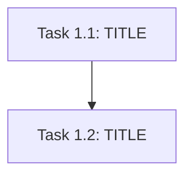

## Mode: Single-pass (default)

Generate the complete tasks.md (§0 through §5) in a single response. Bug fixes
are typically single-phase — there is no `phase_scope` metadata for this schema.

### Completeness rules
- **§5 Orchestration notes is MANDATORY** — never omit. Include Retry Boundaries, Merge Conflict
  Hotspots (bindata, zz_generated, vendor), and Open Questions blocking specific Task IDs.
- **Every Task ID in §3 manifest MUST have a matching §4 payload subsection.** If output length is
  constrained, shorten Implementation notes and Acceptance criteria bullets — do NOT skip tasks.
- **Generation priority when space-constrained:** §0 coverage checklist → §3 manifest (all tasks) →
  §2 linear order → §1 DAG → §4 payloads (all tasks, brief) → §5 orchestration notes.
- Unit test co-generation: every Go implementation task MUST include test co-generation in its
  §4 Acceptance criteria (not separate tasks). Use actual Makefile targets from the target repo.

### Output sections — use these EXACT `##` headings in your response

## 0. Input coverage checklist
One bullet per RCA finding and bugfix-plan action, each with the Task IDs that cover it.
Every root cause finding and fix approach item must appear.

## 1. Task Dependency Graph (Mermaid)

## 2. Linear Execution Order
1. T1_1 — [TITLE]
2. T1_2 — [TITLE]
...

## 3. Task Execution Manifest
| Task ID | Task Title | Assigned Agent | Depends On | Parallel OK | Complexity | Risk |
|---------|-----------|---------------|-----------|------------|-----------|------|
| T1_1 | [TITLE] | [AGENT_ID] | none | No | [1-8] | [Low/Med/High] |

## 4. Task Specifications (Payloads)
### Task <ID>: <Title>
- **Objective:** ...
- **Root cause trace:** ... (link back to specific RCA finding in rca-report.md)
- **Target file(s):** ... (from rca-report.md/bugfix-plan.md only)
- **Non-goals / forbidden edits:** ...
- **Implementation notes:** ... (non-code)
- **Acceptance criteria:** ... (trace to rca-report.md)
- **Downstream handoff:** ...

## 5. Orchestration Notes
- Retry Boundaries
- Merge Conflict Hotspots
- Open Questions Requiring SME Before Execution

### Quality self-check
- [ ] §0 lists every RCA finding and bugfix-plan action with covering Task IDs
- [ ] AgentRoutingMode matches constitution.md (PROVIDED vs PROVISIONAL)
- [ ] §3 manifest row count equals §4 payload subsection count (every ID covered)
- [ ] §2 linear order is a valid topological sort of §1 DAG
- [ ] Assigned Agent values exist in agents.md (REQUIRED — exact IDs from resolved agents.md)
- [ ] Target file(s) in each payload trace to rca-report.md or bugfix-plan.md (marked PARTIAL if uncertain)
- [ ] §5 present with Retry Boundaries, Merge Conflict Hotspots, and Open Questions
- [ ] No truncated mid-task payloads; document ends cleanly after §5

### Task sizing
If user message metadata contains `task_sizing`, apply **Task consolidation rules**
from the base tasks-template.md after generating §3–§4. Verify §3 row count is within
[min, max]. Do NOT prompt the user — sizing was already collected.
